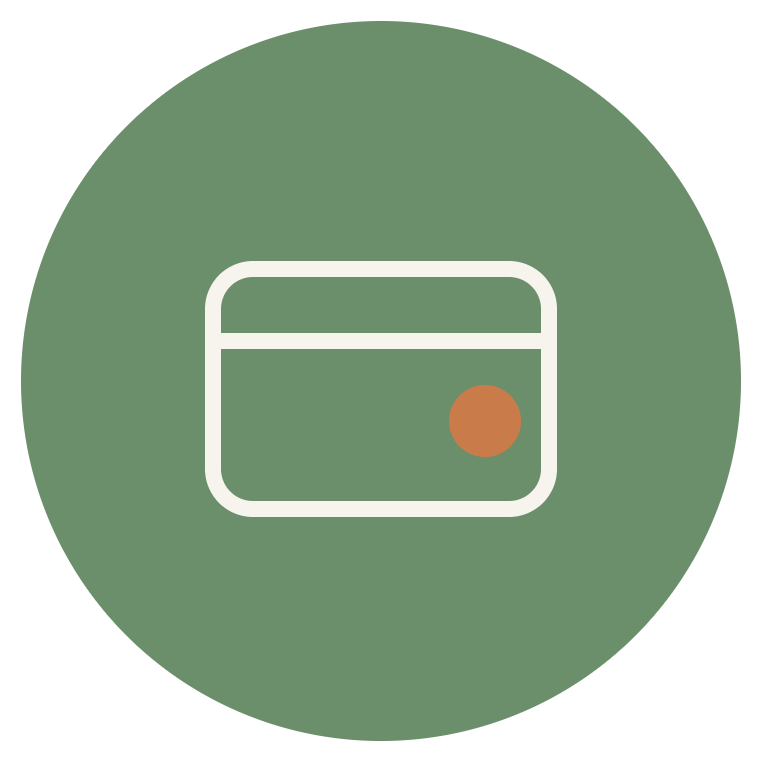
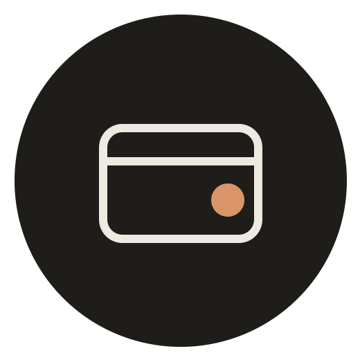

# الأيقونة الديناميكية للجهاز (App Icon)

> **الأصول:** `assets/wifra_logo.*` (لوحة البراندينغ الكاملة) → مقصوصة إلى `wifra_icon.*` و`wifra_icon_dark.*` بهامش موحد · **الكود:** `lib/core/services/app_icon_service.dart` + `android/app/src/main/kotlin/.../MainActivity.kt` + `AndroidManifest.xml` · **الثيم:** `lib/core/theme/theme_service.dart` + `motion.dart`

## الملفات والصور

<p align="center">
  
  &nbsp;&nbsp;
  
</p>

| الملف | الأبعاد | ما يمثله |
|---|---|---|
| `wifra_logo.svg` / `.png` | 680×320 / 2720×1280 | لوحة البراندينغ الأصلية بالنسختين والنص التسويقي |
| `wifra_icon.svg` | 212×212 viewBox (دائرة r=90 في 106,106) | متجه نهاري بهامش 16px متساوٍ |
| `wifra_icon_dark.svg` | 152×152 viewBox (دائرة r=60 في 76,76) | متجه ليلي بهامش 16px متساوٍ |
| `wifra_icon.png` | 760×760 | راستر نهاري مقصوص من اللوحة بنفس الهامش |
| `wifra_icon_dark.png` | 520×520 | راستر ليلي |

> **قاعدة الهامش:** الدائرة تُركّز في المنتصف ويُوسّع الـ viewBox بمقدار 16px من كل جهة — فراغ تنفس يمنع التصاق الحواف عند عرضها داخل بطاقة «عن التطبيق» أو كطبقة foreground تكيفية.

## كيف تُستخدم

- في الكود يمكن عرض المتجه مباشرة: `SvgPicture.asset('assets/wifra_icon.svg')` واختيار الداكن عند `Get.isDarkMode`.
- شاشة التحميل حالياً ترسم الشعار بالويدجت بألوان الثيم المتكيّفة؛ المتجهات جاهزة إن أردت استبداله بصورة ثابتة مطابقة للوحة حرفياً.

## آلية التبديل حسب الوضع المخزّن

### 1) التخزين

`ThemeService` يفتح صندوق Hive منفصل `ui` قبل `runApp` ويحفظ `ThemeMode` بفهرسه. `Motion` يزامن `reduceMotion` من نفس الصندوق. أول تثبيت بلا قيمة → `ThemeMode.system` الذي يُحل إلى **نهاري** افتراضياً في معظم الأجهزة.

### 2) الاستعادة عند الإقلاع (`lib/main.dart`)

```dart
await ThemeService.init();
Motion.init();
final mode = ThemeService.load();                 // نهاري/ليلي/نظام
await AppIconService.setIcon(isDark: mode == ThemeMode.dark);
runApp(WafrahApp(initialThemeMode: mode));
```

الأيقونة تُزامن **قبل** بناء أول إطار — لا وميض.

### 3) التبديل من الإعدادات (`SettingsController.setDarkMode`)

```dart
Get.changeThemeMode(mode);        // تحديث حي فوري
ThemeService.save(mode);          // استمرارية
AppIconService.setIcon(isDark: value);
```

### 4) الطبقة الواطئة

- في `AndroidManifest.xml` حُذف `intent-filter` الـ LAUNCHER من `MainActivity` ونُقل إلى aliasين:
  - `MainActivityLight` — مفعّل افتراضياً، أيقونة `@mipmap/ic_launcher` + adaptive foreground فاتح
  - `MainActivityDark` — معطّل افتراضياً، أيقونة `@mipmap/ic_launcher_dark`
- `MainActivity.kt` يستمع على قناة `com.wafrah.wafrah/app_icon` بطريقة `setIcon(isDark)` ويبدّل حالة المكونين عبر `PackageManager.setComponentEnabledSetting(..., DONT_KILL_APP)`.
- الأحجام المولدة: mipmaps تقليدية 48→192 وطبقات foreground تكيفية 108→432 لكل وضع، مع لون خلفية `ic_launcher_background` (`#6B8E6B`) و`ic_launcher_dark_background` (`#1E1D1A`) لتعمل بشكل صحيح مع كل أشكال الأقنعة (دائرة/مربع مدوّر/سكويركل) من Android 8 فما فوق.

> **ملاحظة تركيب:** بعد إضافة الـ aliases يحتاج الأمر **إلغاء تثبيت ثم تثبيت نظيف** مرة واحدة حتى يسجل النظام المكونات الجديدة.

## الخلاصة

المستخدم يختار الوضع مرة واحدة من الإعدادات — التطبيق يحفظه، يزامن الثيم والأيقونة فوراً، ويستعيده تلقائياً في كل إقلاع لاحق دون تدخل.
